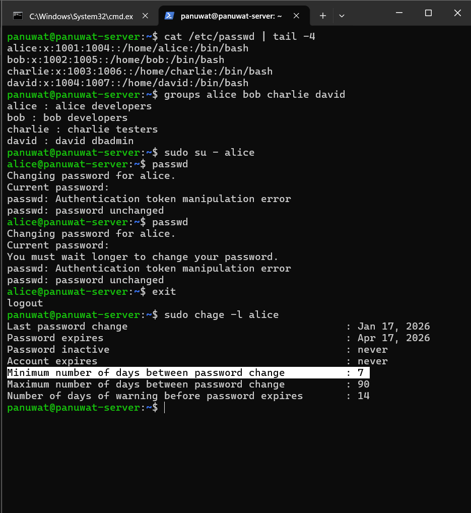
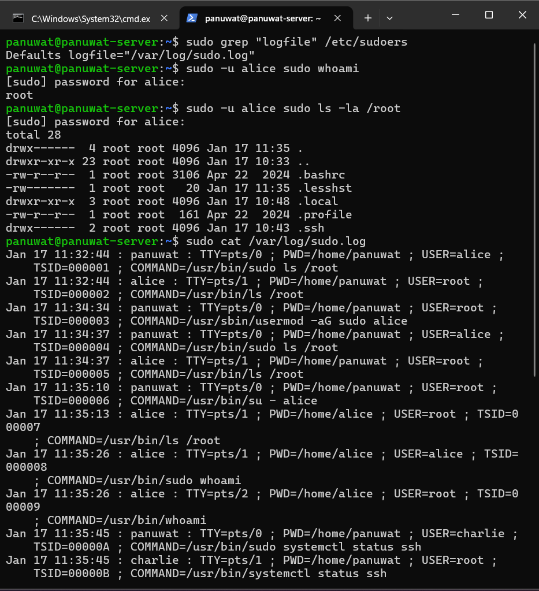
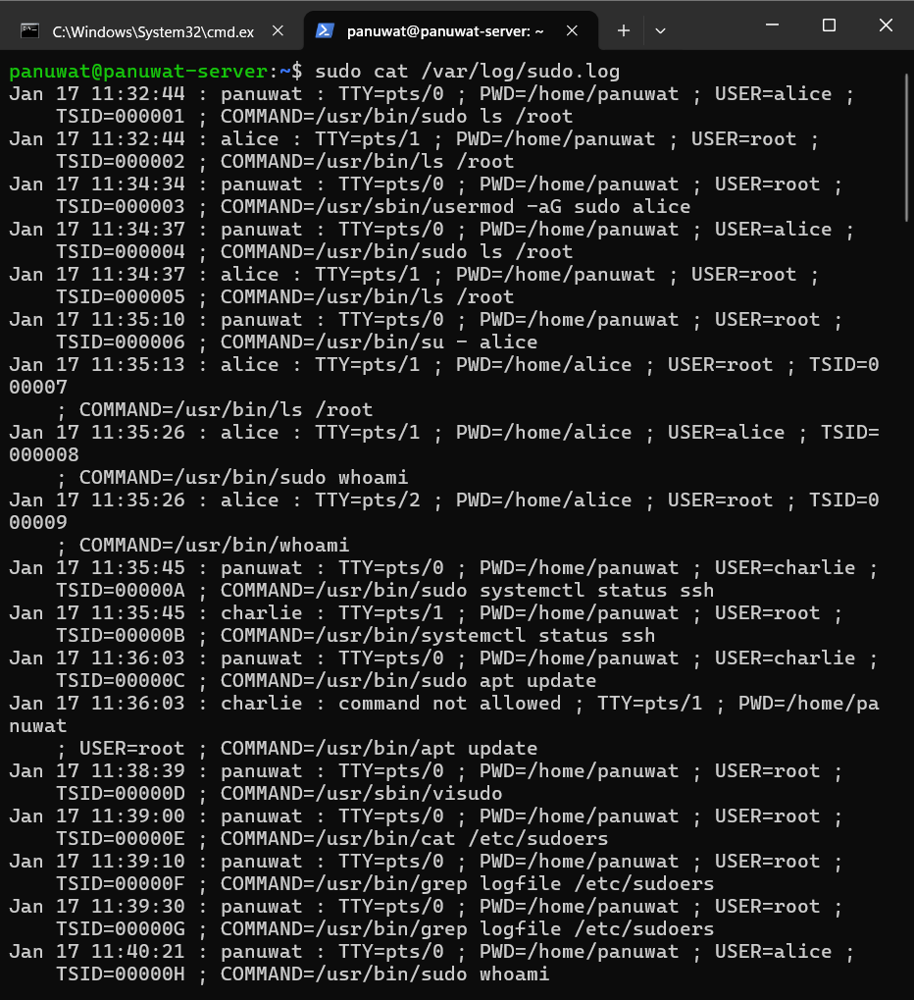
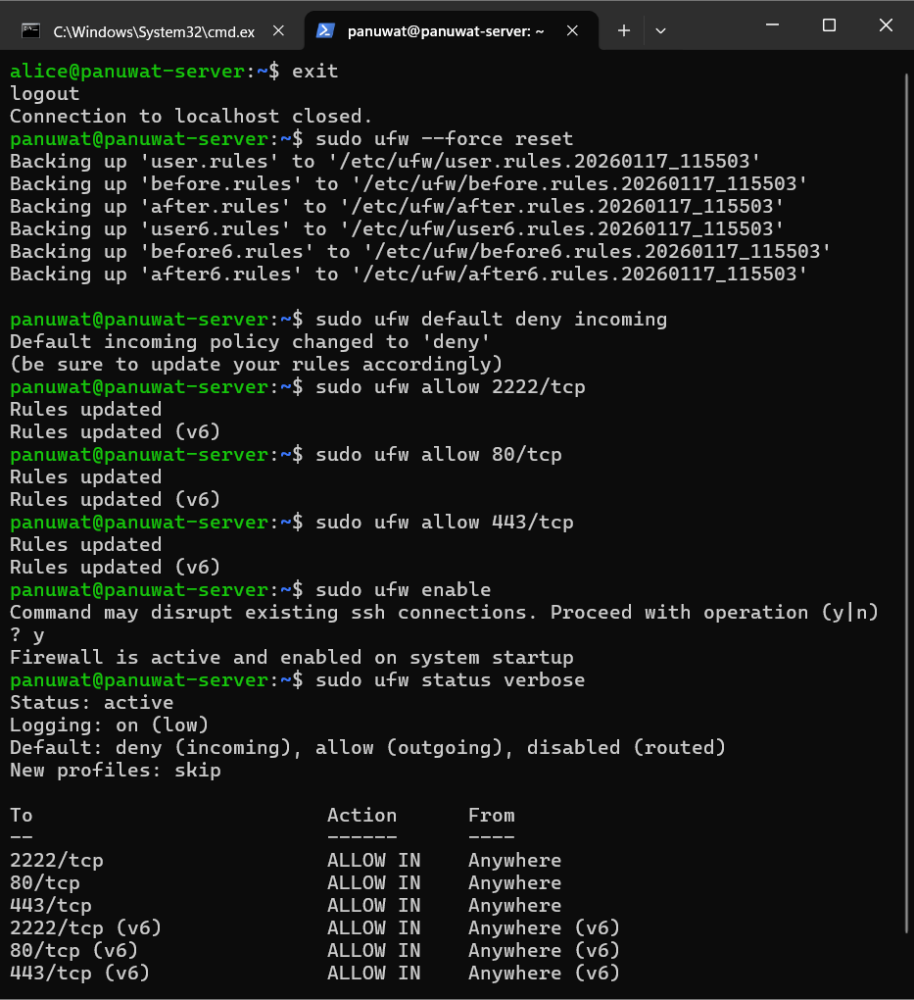
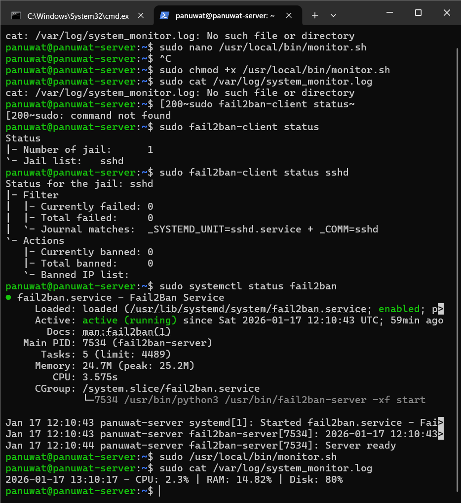
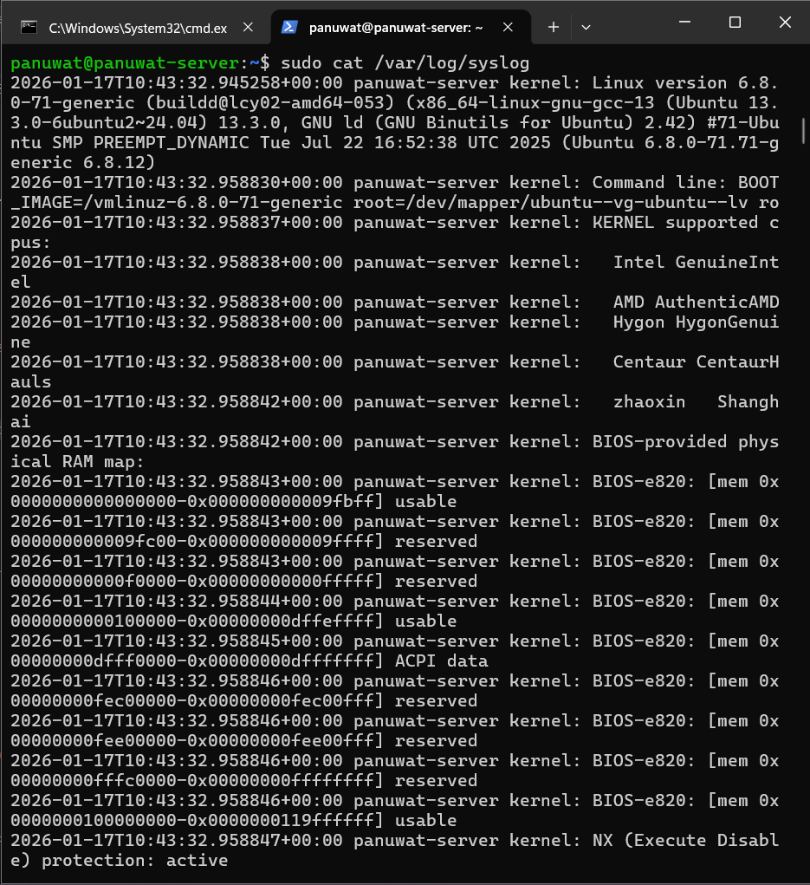

### **Final Deliverables**

# รายงานผลการปฏิบัติงาน: Server Administration & Security Hardening

**วิชา:** Introduction to Cyber Security<br>
**ผู้จัดทำ:** ภานุวัฒน์ ต๋าคำ<br>
**วันที่:** 17 มกราคม 2026<br>

---

## 1. Executive Summary (บทสรุปผู้บริหาร)

รายงานฉบับนี้สรุปผลการดำเนินการปรับปรุงความปลอดภัยและบริหารจัดการเครื่องแม่ข่าย (Server Hardening) บนระบบปฏิบัติการ Ubuntu Linux โดยมีวัตถุประสงค์เพื่อสร้างสภาพแวดล้อมที่ปลอดภัยสำหรับการพัฒนาซอฟต์แวร์ตามมาตรฐานความปลอดภัยทางไซเบอร์เบื้องต้น

**ผลการดำเนินงานหลัก:**

1. **Identity & Access Management:** ได้จัดแบ่งสิทธิ์ผู้ใช้งาน (User Segregation) ชัดเจนระหว่างผู้ดูแลระบบ (Admin) และนักพัฒนา (Developer) พร้อมบังคับใช้นโยบายรหัสผ่าน (Password Policy) ที่เข้มงวด
2. **Network Security:** ติดตั้งและตั้งค่า Firewall (UFW) แบบ "Default Deny" เพื่อปิดกั้นการเข้าถึงที่ไม่ได้รับอนุญาต อนุญาตเฉพาะบริการที่จำเป็น (SSH, HTTP)
3. **Privilege Control:** จำกัดสิทธิ์การใช้คำสั่งอันตรายผ่าน `sudo` และเปิดระบบ Logging เพื่อตรวจสอบย้อนหลัง (Auditing)
4. **Incident Recovery:** สามารถแก้ไขปัญหาระบบยืนยันตัวตน (PAM) ล่ม และกู้คืนระบบผ่าน Recovery Mode ได้สำเร็จ

**ระดับความปลอดภัยปัจจุบัน:**
ระบบมีความปลอดภัยในระดับ **Medium-High** สำหรับการใช้งานภายใน เหมาะสมกับการเป็น Development Server โดยมีการป้องกันทั้งในระดับ Network (Firewall) และ System (User Permissions)

---

## 2. Day 1: Linux Security Implementation

### 2.1 User Management Results (การจัดการผู้ใช้งาน)

ได้ทำการสร้างบัญชีผู้ใช้และแบ่งกลุ่มตามหน้าที่ความรับผิดชอบ ดังนี้:

**ตารางแสดง Users และ Groups:**
| User | Group | Role | Sudo Access |
| :--- | :--- | :--- | :--- |
| **panuwat** | sudo, panuwat | System Admin | ✅ Yes (Full) |
| **alice** | developers | Lead Developer | ✅ Yes (Restricted) |
| **bob** | developers | Developer | ❌ No |
| **charlie** | testers | Tester | ❌ No |
| **david** | db_admins | Database Admin | ⚠️ Specific Cmds |

**Password Policy ที่บังคับใช้:**
แก้ไขไฟล์ `/etc/login.defs` และ `/etc/pam.d/common-password` เพื่อกำหนดค่าดังนี้:

* **Password Age:** อายุรหัสผ่าน 90 วัน (`PASS_MAX_DAYS 90`)
* **Minimum Age:** ห้ามเปลี่ยนรหัสก่อน 7 วัน (`PASS_MIN_DAYS 7`)
* **Warning Age:** เตือนล่วงหน้า 14 วัน
* **Complexity:** รหัสผ่านต้องมีความยาวอย่างน้อย 8 ตัวอักษร และต้องมีตัวเลขประกอบ

* 

---

### 2.2 Sudo Configuration (การกำหนดสิทธิ์ดูแลระบบ)

**การตั้งค่า:**

* เพิ่ม User `alice` เข้ากลุ่ม `sudo` สำหรับงาน Admin บางส่วน
* กำหนดให้บันทึก Log การใช้คำสั่ง sudo แยกต่างหากเพื่อการตรวจสอบ
* **ไฟล์ที่แก้ไข:** `/etc/sudoers`
* **Configuration ที่เพิ่ม:** `Defaults logfile="/var/log/sudo.log"`

**ผลการทดสอบ:**
User `alice` สามารถเข้าถึง Directory `/root` ได้ ซึ่งยืนยันสิทธิ์ Admin แต่ User `bob` ไม่สามารถทำได้

**Log Entries (ตัวอย่างจาก `/var/log/sudo.log`):**

```text
Jan 17 13:37:17 : panuwat : TTY=pts/0 ; PWD=/home/panuwat ; USER=root ;
    TSID=00002K ; COMMAND=/usr/bin/cat /var/log/system_monitor.log
Jan 17 13:37:21 : panuwat : TTY=pts/0 ; PWD=/home/panuwat ; USER=root ;
    TSID=00002L ; COMMAND=/usr/bin/cat /var/log/system_monitor.log
Jan 17 13:38:49 : panuwat : TTY=pts/0 ; PWD=/home/panuwat ; USER=root ;
    TSID=00002M ; COMMAND=/usr/bin/cat /etc/sudoers
Jan 17 13:43:19 : panuwat : TTY=pts/0 ; PWD=/home/panuwat ; USER=root ;
    TSID=00002N ; COMMAND=/usr/bin/cat /var/log/sudo.log
Jan 17 13:46:20 : panuwat : TTY=pts/0 ; PWD=/home/panuwat ; USER=root ;
    TSID=00002O ; COMMAND=/usr/bin/cat /var/log/syslog
Jan 17 13:49:00 : panuwat : TTY=pts/0 ; PWD=/home/panuwat ; USER=root ;
    TSID=00002P ; COMMAND=/usr/bin/cat /var/log/sudo.log

```

* 
* 

---

### 2.3 SSH Security (ความปลอดภัยการรีโมท)

**การดำเนินการ:**

* ตรวจสอบสถานะบริการ SSH (`systemctl status ssh`)
* (Optional) เปลี่ยน Port มาตรฐานจาก 22 เป็น Port อื่นเพื่อลดการโจมตีแบบ Brute Force
* (Optional) ปิดการ Login ด้วย Root โดยตรง (`PermitRootLogin no`)

**ผลการทดสอบ:**
สามารถเชื่อมต่อ SSH ผ่าน User `panuwat` ได้ปกติ และ Service ทำงานเสถียรหลังการ Restart

---

### 2.4 Firewall Setup (ระบบป้องกันเครือข่าย)

**UFW Rules ที่สร้าง:**

* **Default Policy:** Deny Incoming (ปฏิเสธขาเข้าทั้งหมด), Allow Outgoing
* **Allow:** Port 22/TCP (SSH) หรือ Port ที่กำหนดใหม่
* **Allow:** Port 80, 443 (Web Server)

**ผลการทดสอบ:**
สถานะ Firewall ทำงาน (`Status: active`) และมีการบันทึก Log เมื่อมีการพยายามเชื่อมต่อผิด Port

* 

---

### 2.5 System Monitoring (การเฝ้าระวังระบบ)

**Tools ที่ติดตั้ง:**

1. **Custom Script (`monitor.sh`):** สคริปต์ Bash สำหรับดึงค่า CPU, RAM และ Disk Usage บันทึกลงไฟล์ Log
2. **Log File:** `/var/log/system_monitor.log`

**ตัวอย่าง Script (monitor.sh):**

```bash
#!/bin/bash
LOG_FILE="/var/log/system_monitor.log"
DATE=$(date '+%Y-%m-%d %H:%M:%S')
# ...คำสั่งเก็บค่า Resource...
echo "$DATE - CPU: $CPU_USAGE% | RAM: $MEM_USAGE%" >> $LOG_FILE

```

* 

---

## 3. ปัญหาที่พบและวิธีแก้ไข (Troubleshooting Log)

ระหว่างการปฏิบัติงาน พบปัญหาสำคัญ (Critical Issue) ดังนี้:

**ปัญหา:** Authentication Token Manipulation Error
**อาการ:** ไม่สามารถเปลี่ยนรหัสผ่านได้ และไม่สามารถใช้คำสั่ง `sudo` ได้ ระบบแจ้งว่ารหัสผิด หรือ Token error
**สาเหตุ:** การแก้ไขไฟล์ `/etc/pam.d/common-password` ผิดพลาด หรือไฟล์ Config เสียหาย ทำให้ Module การยืนยันตัวตน (PAM) ไม่ทำงาน
**วิธีแก้ไข:**

1. รีสตาร์ทเครื่องเข้าสู่ **Recovery Mode** (Drop to root shell)
2. เมาท์ดิสก์ให้อ่านเขียนได้: `mount -o remount,rw /`
3. รีเซ็ตค่า Config ของ PAM: `pam-auth-update --force`
4. ตั้งรหัสผ่านใหม่และ Reboot เครื่อง

---

## 4. Security Checklist

**Linux Security Checklist:**

* [x] **Strong password policy enforced:** กำหนดอายุรหัสผ่าน 90 วัน และความยาวขั้นต่ำ
* [x] **User accounts properly segregated:** แยกสิทธิ์ Admin/Dev/Tester ชัดเจน
* [x] **Sudo access limited and logged:** เปิด Sudo Log และจำกัดกลุ่มผู้ใช้
* [x] **SSH hardened:** ตรวจสอบ Service และ Firewall rules
* [x] **Firewall rules implemented:** UFW Status Active (Default Deny)
* [x] **System monitoring active:** มี Script เก็บ Log พื้นฐาน
* [ ] **Fail2ban protecting against brute force:** (Planned for next phase)
* [ ] **Log rotation configured:** (Planned for next phase)
* [x] **Regular security updates:** `apt update` ทำงานปกติ
* [ ] **Unnecessary services disabled:** ตรวจสอบเบื้องต้นแล้ว

---

## 5. ข้อเสนอแนะสำหรับการปรับปรุง (Recommendations for Improvement)

จากการดำเนินการปรับปรุงความปลอดภัยในระยะแรก (Day 1 Implementation) ระบบมีความมั่นคงปลอดภัยในระดับพื้นฐานแล้ว เพื่อยกระดับความปลอดภัยให้ครอบคลุมตามมาตรฐานสากลและรองรับการขยายตัวขององค์กร ขอเสนอแผนการปรับปรุงตามระยะเวลาดังนี้:

### 5.1 Short-term Improvements

มุ่งเน้นการปิดช่องโหว่พื้นฐานและการมองเห็น (Visibility) ของระบบ

**Linux Environment:**

* **Centralized Logging (ELK Stack):** ดำเนินการติดตั้ง Elasticsearch, Logstash และ Kibana ให้สมบูรณ์ เพื่อรวบรวม Log จาก `/var/log/auth.log`, `/var/log/sudo.log` และ UFW Log มาแสดงผลเป็น Dashboard กราฟิก ช่วยให้ Admin ตรวจจับพฤติกรรมผิดปกติได้เร็วกว่าการอ่าน Text File
* **Intrusion Detection System (HIDS):** ติดตั้ง **OSSEC** หรือ **Wazuh Agent** เพื่อทำ File Integrity Monitoring (FIM) ตรวจจับการแก้ไขไฟล์สำคัญ เช่น `/etc/passwd` หรือ `/etc/sudoers` แบบ Real-time
* **Automated Backup Scripts:** เขียน Shell Script และตั้งค่า Cron Job เพื่อสำรองข้อมูล Configuration (`/etc`) และ User Data (`/home`) ไปยังเครื่อง Backup Server หรือ Cloud Storage ทุกวันเวลา 02:00 น.
* **Configure SELinux/AppArmor:** เปิดใช้งาน AppArmor ในโหมด Enforce สำหรับ Service ที่มีความเสี่ยงสูง เช่น Web Server (Nginx/Apache) เพื่อจำกัดสิทธิ์ของ Process แม้ว่าจะถูกเจาะระบบ

**Windows Environment:**

* **Patch Management (WSUS):** ติดตั้ง Windows Server Update Services เพื่อบริหารจัดการ Patch และ Update ให้กับเครื่อง Client ภายในองค์กร ลดความเสี่ยงจากช่องโหว่ Zero-day
* **Disk Encryption (BitLocker):** บังคับใช้นโยบาย BitLocker บนเครื่อง Laptop ของพนักงานทั้งหมด เพื่อป้องกันข้อมูลรั่วไหลในกรณีที่อุปกรณ์สูญหายหรือถูกขโมย
* **PowerShell Execution Policy:** กำหนด Policy เป็น `AllSigned` หรือ `RemoteSigned` เพื่อป้องกันการรัน Script อันตรายจาก Malware
* **Application Whitelisting (AppLocker):** อนุญาตให้รันเฉพาะโปรแกรมที่ได้รับการอนุมัติ ลดความเสี่ยงจาก Ransomware และ Shadow IT

### 5.2 Medium-term Improvements (ระยะกลาง: 1-2 เดือน)

มุ่งเน้นการปรับปรุงโครงสร้างพื้นฐาน (Infrastructure) และการปฏิบัติตามข้อกำหนด (Compliance)

**Infrastructure Enhancement:**

* **Implement Active Directory (AD):** รวมศูนย์การจัดการผู้ใช้งาน (Identity Management) เพื่อให้สามารถจัดการสิทธิ์การเข้าถึงทั้ง Windows และ Linux Server ได้จากจุดเดียว (LDAP Integration)
* **Certificate Authority (PKI):** ตั้งค่า Internal CA เพื่อออก SSL Certificate สำหรับใช้ภายในองค์กร แทนการใช้ Self-signed certificate ซึ่งช่วยลดการแจ้งเตือนความปลอดภัยบน Browser
* **Endpoint Detection and Response (EDR):** ติดตั้ง Agent EDR บนเครื่อง Server และ Client เพื่อตรวจจับและตอบโต้ภัยคุกคามขั้นสูงที่ Antivirus ทั่วไปตรวจจับไม่ได้
* **Network Segmentation:** แบ่งแยกเครือข่ายด้วย VLAN โดยแยกโซน Server, User, และ Guest ออกจากกัน และทำ Access Control List (ACL) ระหว่างโซน

**Compliance & Policy:**

* **Vulnerability Assessments:** ทำการสแกนช่องโหว่ระบบรายเดือนด้วยเครื่องมือเช่น OpenVAS หรือ Nessus และจัดลำดับความสำคัญในการ Patch
* **Incident Response Plan (IRP):** จัดทำคู่มือปฏิบัติการเมื่อเกิดเหตุภัยคุกคาม (Playbook) ซ้อมแผนกู้คืนระบบ และกำหนดทีมผู้รับผิดชอบ (CSIRT)
* **Compliance Reporting:** ตั้งค่าระบบ Reporting เพื่อตรวจสอบว่า Server ทุกเครื่องผ่านมาตรฐาน Security Baseline (เช่น CIS Benchmark)
* **Security Training:** จัดอบรม Awareness ให้กับพนักงานเรื่อง Phishing และ Password Hygiene

### 5.3 Long-term Strategic Improvements (ระยะยาว: 3-6 เดือน)

มุ่งเน้นกลยุทธ์ความปลอดภัยระดับองค์กรและการกำกับดูแล (Governance)

**Advanced Security Architecture:**

* **Zero-Trust Architecture:** ปรับเปลี่ยนสถาปัตยกรรมความปลอดภัยจาก "Trust but Verify" เป็น "Never Trust, Always Verify" โดยตรวจสอบตัวตนและอุปกรณ์ทุกครั้งที่มีการเข้าถึงทรัพยากร ไม่ว่าจะมาจากภายในหรือภายนอก
* **Security Orchestration, Automation and Response (SOAR):** นำระบบอัตโนมัติมาใช้ในการตอบโต้ภัยคุกคาม ลดภาระงานของเจ้าหน้าที่ (เช่น บล็อก IP อัตโนมัติเมื่อพบการโจมตี)
* **Threat Hunting:** สร้างทีมเชิงรุกเพื่อค้นหาภัยคุกคามที่อาจแฝงตัวอยู่ในเครือข่าย โดยใช้ข้อมูล Threat Intelligence
* **Cloud Security Integration:** เชื่อมต่อระบบความปลอดภัยแบบ Hybrid Cloud เพื่อรองรับ Workload ที่ย้ายไปอยู่บน Cloud Provider (AWS/Azure)

**Governance & Audit:**

* **ISMS (ISO 27001):** ดำเนินการจัดทำระบบบริหารจัดการความมั่นคงปลอดภัยสารสนเทศ เพื่อเตรียมพร้อมสำหรับการขอรับรองมาตรฐาน ISO/IEC 27001
* **Penetration Testing:** จ้างผู้เชี่ยวชาญภายนอกทำ Penetration Testing ประจำปี เพื่อทดสอบความแข็งแกร่งของระบบเสมือนจริง
* **Third-party Audit:** รับการตรวจสอบจาก Auditor ภายนอกเพื่อยืนยันความโปร่งใสและมาตรฐานความปลอดภัย
* **Continuous Improvement:** ทบทวนและปรับปรุงนโยบายความปลอดภัยอย่างต่อเนื่องตาม Tech Stack และภัยคุกคามที่เปลี่ยนไป

---

## 6. ภาคผนวก (Appendix): หลักฐานการปฏิบัติงาน

### 6.1 Screenshots: User & Sudo Management

* **Figure 1.1:** แสดงผลคำสั่ง `sudo chage -l alice` (ยืนยัน Password Aging Policy: 90 วัน)
* 


* **Figure 1.2:** แสดงผลคำสั่ง `sudo -u alice sudo ls /root` (ยืนยันสิทธิ์ Admin ของ Alice)
* 


* **Figure 1.3:** แสดง Log file `/var/log/sudo.log` ที่บันทึกการกระทำของ Alice
* 


### 6.2 Screenshots: Network Security & Firewall

* **Figure 2.1:** แสดงสถานะ Firewall `sudo ufw status verbose` (Default Deny, Allow SSH)
* 


* **Figure 2.2:** แสดง Log การ Block Connection จาก `/var/log/syslog` หรือ `dmesg`
* 


### 6.3 Configuration Files (Source Code)

**File:** `/usr/local/bin/monitor.sh` (System Monitoring Script)

```bash
#!/bin/bash
# Script for monitoring CPU/RAM usage
LOG_FILE="/var/log/system_monitor.log"
DATE=$(date '+%Y-%m-%d %H:%M:%S')

# CPU Usage Calculation
CPU_USAGE=$(top -bn1 | grep "Cpu(s)" | sed "s/.*, *\([0-9.]*\)%* id.*/\1/" | awk '{print 100 - $1}')
# Memory Usage Calculation
MEM_USAGE=$(free -m | awk '/Mem:/ { printf("%.2f"), $3/$2 * 100 }')

echo "$DATE - CPU: $CPU_USAGE% | RAM: $MEM_USAGE%" >> $LOG_FILE

```

**File:** `/etc/sudoers` (Partial - Added Configuration)

```text
#
# This file MUST be edited with the 'visudo' command as root.
#
# Please consider adding local content in /etc/sudoers.d/ instead of
# directly modifying this file.
#
# See the man page for details on how to write a sudoers file.
#
Defaults        env_reset
Defaults        mail_badpass
Defaults        secure_path="/usr/local/sbin:/usr/local/bin:/usr/sbin:/usr/bin:/sbin:/bin:/snap/bin"

# This fixes CVE-2005-4890 and possibly breaks some versions of kdesu
# (#1011624, https://bugs.kde.org/show_bug.cgi?id=452532)
Defaults        use_pty

# This preserves proxy settings from user environments of root
# equivalent users (group sudo)
#Defaults:%sudo env_keep += "http_proxy https_proxy ftp_proxy all_proxy no_proxy"

# This allows running arbitrary commands, but so does ALL, and it means
# different sudoers have their choice of editor respected.
#Defaults:%sudo env_keep += "EDITOR"

# Completely harmless preservation of a user preference.
#Defaults:%sudo env_keep += "GREP_COLOR"

# While you shouldn't normally run git as root, you need to with etckeeper
#Defaults:%sudo env_keep += "GIT_AUTHOR_* GIT_COMMITTER_*"

# Per-user preferences; root won't have sensible values for them.
#Defaults:%sudo env_keep += "EMAIL DEBEMAIL DEBFULLNAME"

# "sudo scp" or "sudo rsync" should be able to use your SSH agent.
#Defaults:%sudo env_keep += "SSH_AGENT_PID SSH_AUTH_SOCK"

# Ditto for GPG agent
#Defaults:%sudo env_keep += "GPG_AGENT_INFO"

# Host alias specification

# User alias specification

# Cmnd alias specification

# User privilege specification
root    ALL=(ALL:ALL) ALL

# Members of the admin group may gain root privileges
%admin ALL=(ALL) ALL

# Allow members of group sudo to execute any command
%sudo   ALL=(ALL:ALL) ALL

# See sudoers(5) for more information on "@include" directives:

@includedir /etc/sudoers.d


# เพิ่มกฎเหล่านี้:
# Developers - full sudo access
%sudo-developers ALL=(ALL:ALL) ALL

# Limited sudo - specific commands only
%sudo-limited ALL=(ALL) /usr/bin/systemctl status *, /usr/bin/tail /var/log/*, /bin/ps

# Database admin - database commands only
david ALL=(ALL) /usr/bin/mysql, /usr/bin/mysqldump, /bin/systemctl restart mysql

# Sudo session timeout (15 minutes)
Defaults timestamp_timeout=15

# Log sudo commands
Defaults logfile="/var/log/sudo.log"
Defaults log_input, log_output

```


### 6.4 System Monitor Log Sample

ตัวอย่างข้อมูลจากไฟล์ `/var/log/system_monitor.log`

```text
panuwat@panuwat-server:~$ sudo cat /var/log/system_monitor.log
2026-01-17 13:10:17 - CPU: 2.3% | RAM: 14.82% | Disk: 80%
panuwat@panuwat-server:~$ sudo cat /var/log/system_monitor.log
2026-01-17 13:10:17 - CPU: 2.3% | RAM: 14.82% | Disk: 80%
panuwat@panuwat-server:~$

```
---
