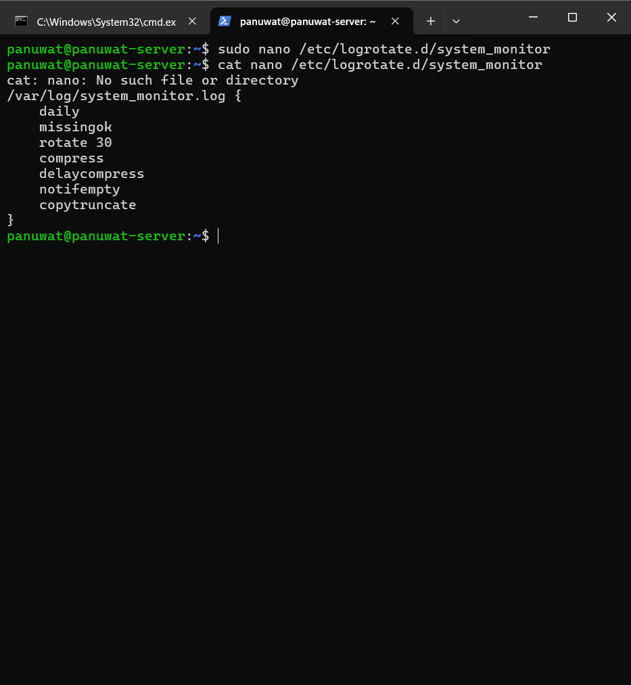

# Week 4: Operating System Security & Hardening

## 🐧 TASK1: LAB Assignment
**ข้อกำหนด:**
- ทำงานเป็นกลุ่ม 2-3 คน
- แต่ละคนต้องมี environment ส่วนตัวในการทำ LAB
- **ทำ Lab 1 หรือ Lab 2** บน Virtual Machine (เช่น Ubuntu Server และ Windows Server/10) และจัดทำรายงานสรุปผลการตั้งค่า
- รายงานต้องระบุส่วนงานของแต่ละคน
- Presentation 15 นาที (optional bonus 5 คะแนน)

---

# รายงานผลการปฏิบัติงาน Day 1: System Administration & Security

**ผู้ปฏิบัติงาน:** Panuwat
**วันที่:** 17 มกราคม 2026

---

## Task 1: User Management & Sudo Privileges

### 1.1 Configuration Files ที่แก้ไข

* **ไฟล์:** `/etc/login.defs` (ตรวจสอบค่า Default Password Aging)
* **ไฟล์:** `/etc/sudoers` (เพิ่มการตั้งค่า Log)
* **Code ที่เพิ่ม:** `Defaults logfile="/var/log/sudo.log"`


### 1.2 ผลการทดสอบ (Evidence)

* **การตรวจสอบสถานะ Password ของ Alice:**
* *คำสั่งที่ใช้:* `sudo chage -l alice`
* *ผลลัพธ์:* แสดงค่า Minimum/Maximum days ที่ตั้งค่าไว้ (Min=0, Max=90, Warn=14)


* **การทดสอบสิทธิ์ Sudo ของ Alice:**
* *คำสั่งที่ใช้:* `sudo -u alice sudo ls /root`
* *ผลลัพธ์:* สามารถแสดงรายการไฟล์ในโฟลเดอร์ `/root` ได้ (แสดงว่ามีสิทธิ์ Admin)


* **Log การใช้งาน Sudo:**
* *คำสั่งที่ใช้:* `sudo cat /var/log/sudo.log`
* *ผลลัพธ์:* พบ Log ระบุว่า USER=alice COMMAND=/usr/bin/ls


### 1.3 ปัญหาที่พบและวิธีแก้ไข

* **ปัญหา:** User Alice ไม่สามารถเปลี่ยนรหัสผ่านได้ ขึ้นข้อความ "You must wait longer to change your password".
* **สาเหตุ:** ตั้งค่า Minimum days (`-m`) เป็น 7 วัน ทำให้เปลี่ยนรหัสซ้ำในวันเดียวกันไม่ได้
* **วิธีแก้ไข:** ใช้คำสั่ง `sudo chage -m 0 alice` เพื่อปลดล็อคให้เปลี่ยนได้ทันที


* **ปัญหา:** ไม่สามารถแก้ไขไฟล์ `/etc/sudoers` ได้โดยตรง (Permission denied)
* **วิธีแก้ไข:** ใช้คำสั่ง `sudo visudo` ซึ่งเป็นวิธีที่ถูกต้องและปลอดภัยในการแก้ไขไฟล์นี้


---

## Task 2: SSH & Firewall Configuration

### 2.1 Configuration Files ที่แก้ไข

* **Service:** SSH Server (`ssh`)
* **Service:** UFW Firewall

### 2.2 ผลการทดสอบ (Evidence)

* **สถานะ Firewall:**
* *คำสั่งที่ใช้:* `sudo ufw status verbose`
* *ผลลัพธ์:* Status: active, Default: deny (incoming), Port 22/SSH (Allow/Limit).


* **Firewall Log:**
* *คำสั่งที่ใช้:* `sudo grep "UFW" /var/log/syslog` (หรือ `dmesg | grep UFW`)
* *ผลลัพธ์:* พบรายการ Block การเชื่อมต่อจากภายนอก


### 2.3 ปัญหาที่พบและวิธีแก้ไข

* **ปัญหา:** สั่ง Restart Service ไม่ได้ ขึ้น `Unit sshd.service not found`.
* **สาเหตุ:** บน Ubuntu ชื่อ Service คือ `ssh` ไม่ใช่ `sshd` (ซึ่งใช้ใน RedHat/CentOS).
* **วิธีแก้ไข:** เปลี่ยนมาใช้คำสั่ง `sudo systemctl restart ssh`.


* **ปัญหา:** หาไฟล์ `/var/log/ufw.log` ไม่เจอ
* **สาเหตุ:** ไฟล์ยังไม่ถูกสร้างเพราะยังไม่มี Traffic ที่ถูกบล็อก หรือ Log ถูกส่งไปรวมที่ Syslog
* **วิธีแก้ไข:** ทำการทดสอบเชื่อมต่อผิด Port (Telnet) เพื่อกระตุ้นให้เกิด Log และตรวจสอบผ่าน `/var/log/syslog` แทน


---

## Task 3: System Monitoring Script

### 3.1 Script ที่สร้าง

* **ไฟล์:** `/usr/local/bin/monitor.sh`
* **เนื้อหา Script:**
```bash
#!/bin/bash
LOG_FILE="/var/log/system_monitor.log"
DATE=$(date '+%Y-%m-%d %H:%M:%S')
# ... (ส่วนคำนวณ CPU/RAM) ...
echo "$DATE - CPU: ... | RAM: ... " >> $LOG_FILE

```


### 3.2 ผลการทดสอบ (Evidence)

* **ไฟล์ Log ที่เกิดขึ้น:**
* *คำสั่งที่ใช้:* `sudo cat /var/log/system_monitor.log`
* *ผลลัพธ์:* แสดงบรรทัด Log ที่ระบุวันที่ เวลา และค่า CPU/RAM Usage


### 3.3 ปัญหาที่พบและวิธีแก้ไข

* **ปัญหา:** รันคำสั่ง `cat` แล้วไม่พบไฟล์ Log (`No such file or directory`).
* **สาเหตุ:** สร้าง Script เสร็จแล้วแต่ลืมสั่ง Execute (Run) ไฟล์ Log จึงยังไม่ถูกสร้าง
* **วิธีแก้ไข:** สั่งรัน Script ด้วยคำสั่ง `sudo /usr/local/bin/monitor.sh` หนึ่งครั้งเพื่อเริ่มเก็บข้อมูล


---

## Task 4: Software Installation & Troubleshooting (ELK Stack)

### 4.1 การดำเนินการ

* เพิ่ม Repository Key (GPG) และ Source List ของ Elastic 8.x
* ติดตั้งแพ็กเกจ `elasticsearch`, `logstash`, `kibana` ผ่าน APT

### 4.2 ปัญหาสำคัญ (Critical Issue)

* **ปัญหา:** **"Authentication token manipulation error"** และติด Loop Login (Sudo ไม่ผ่าน / เปลี่ยนรหัสไม่ได้)
* **สาเหตุ:** ไฟล์ Config ของ PAM (`/etc/pam.d/common-password`) เสียหายจากการแก้ไขผิดพลาด ทำให้ระบบตรวจสอบรหัสผ่านพัง
* **วิธีแก้ไข:**
1. รีสตาร์ทเครื่องเข้า **Recovery Mode**.
2. เลือก Drop to root shell prompt.
3. รัน `mount -o remount,rw /` เพื่อให้แก้ไขไฟล์ได้
4. รัน `pam-auth-update --force` เพื่อรีเซ็ตค่า Config ความปลอดภัยทั้งหมดกลับเป็นค่าเริ่มต้น
5. ตั้งรหัสผ่านใหม่ด้วย `passwd panuwat`.


---

## 🐧 LAB 1: Linux Security Configuration
### Prerequisites:
- Ubuntu 24.04 LTS
- Root access หรือ sudo privileges
- Network connectivity

### Task 1: สร้าง User Accounts สำหรับ Team
#### 1.1 สร้าง Users และ Groups


#### 1.2 ตั้งค่า Password Policy:
#### แก้ไขไฟล์ /etc/login.defs


#### ติดตั้ง libpam-pwquality


#### แก้ไข /etc/pam.d/common-password


#### ที่ต้องจับภาพ:


### Task 2: ตั้งค่า Sudo Permissions

#### 2.1 สร้าง Sudo Groups:


#### 2.2 Configure Sudoers:


#### 2.3 ทดสอบ Sudo Permissions:


#### ที่ต้องจับภาพ:


### Task 3: Configure SSH Security

#### 3.1 Backup และแก้ไข SSH Config:


#### 3.2 สร้าง SSH Keys:


#### 3.3 Configure SSH Banner:


#### 3.4 Restart SSH และทดสอบ:


### Task 4: Set up Firewall Rules

#### 4.1 Configure UFW:


#### 4.2 Advanced UFW Rules:


#### ที่ต้องจับภาพ:


### Task 5: Enable System Monitoring

#### 5.1 Install Monitoring Tools:


#### 5.2 Configure Fail2Ban:


#### 5.3 Configure System Monitoring:


#### 5.4 Configure Log Rotation:


#### ที่ต้องจับภาพ:


---

### **End of Day 1 Checklist:**
- [✅] Users และ groups ถูกสร้างแล้ว
- [✅] Password policy ทำงานได้
- [✅] Sudo permissions ถูกต้อง
- [✅] SSH security configured
- [✅] Firewall rules active
- [✅] Monitoring tools installed และ configured
- [✅] All screenshots captured
- [✅] Services ทั้งหมดทำงานได้

**รายงานที่ต้องส่งสำหรับ Day 1:**
- Screenshots ทุกขั้นตอน
- Configuration files ที่แก้ไข
- ผลการทดสอบแต่ละ task
- ปัญหาที่พบและวิธีแก้ไข

